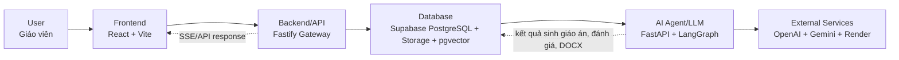
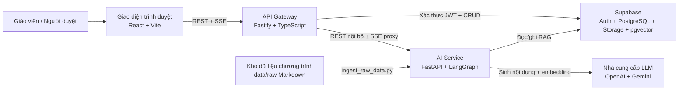
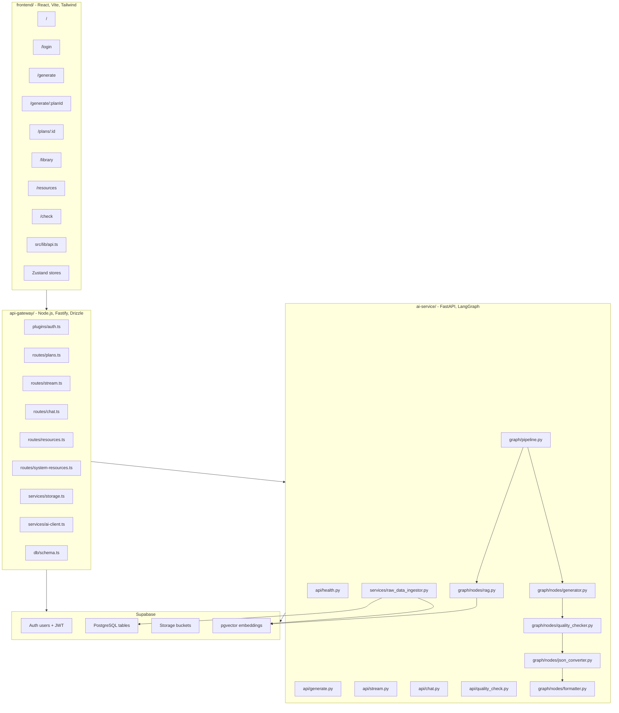
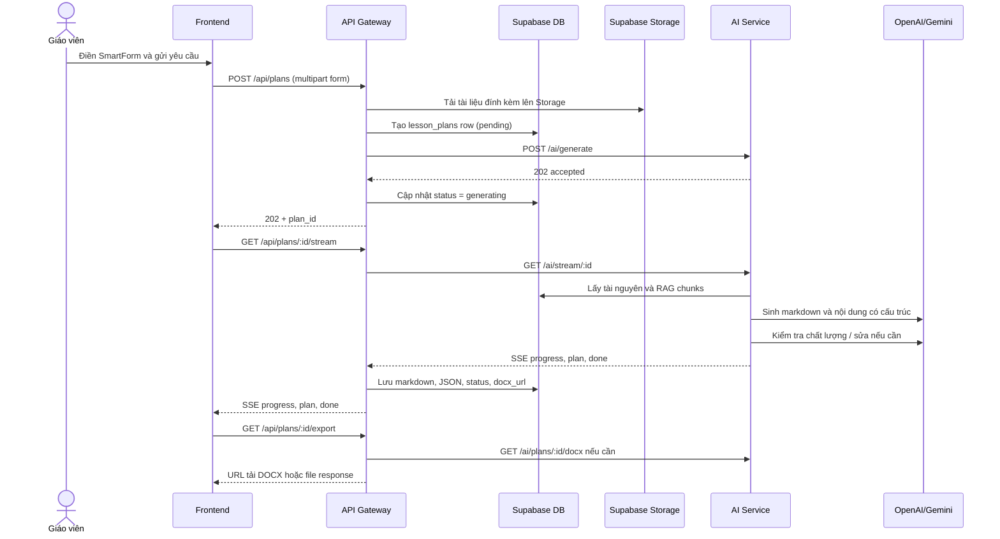
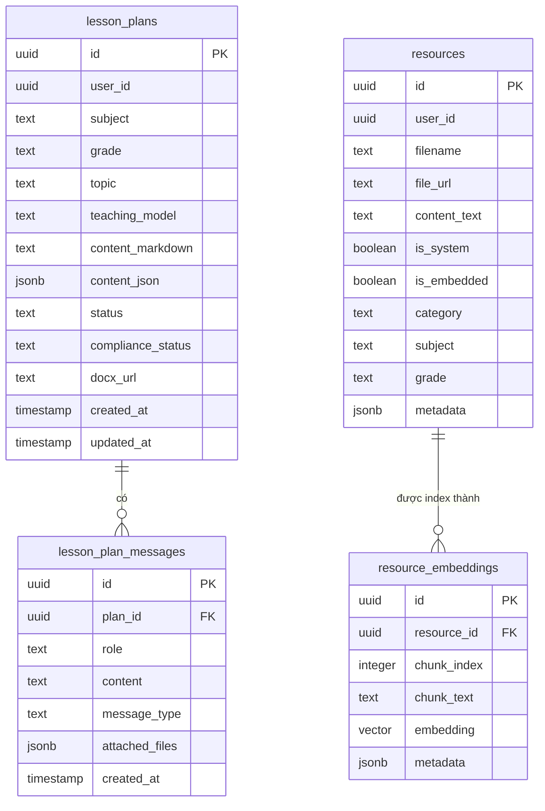
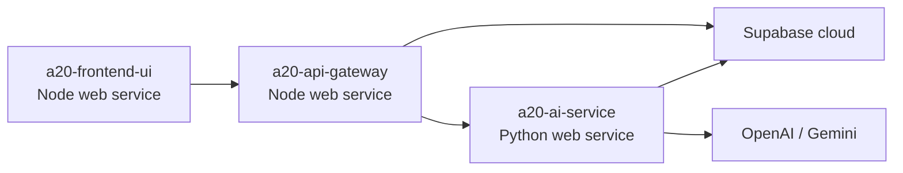

# Sơ đồ kiến trúc

Dự án: A20 App 003 - Soạn giáo án thông minh

Cập nhật lần cuối: 2026-05-16

## Sơ đồ tóm tắt theo yêu cầu

Sơ đồ này dùng để đối chiếu nhanh với yêu cầu trong ảnh: người dùng đi qua frontend, backend/API, database, AI Agent/LLM và các dịch vụ bên ngoài; phần chi tiết bên dưới mô tả đúng các kết nối triển khai thực tế.

## 1. Bối cảnh hệ thống

## 2. Sơ đồ container

## 3. Luồng sinh giáo án chính

## 4. Tổng quan mô hình dữ liệu

## 5. Cổng chạy cục bộ

| Thành phần | URL cục bộ | Ghi chú |
|---|---|---|
| Frontend | `http://localhost:5173` | Vite dev server |
| API Gateway | `http://localhost:3001` | Fastify REST API và SSE proxy |
| AI Service | `http://localhost:8000` | FastAPI service nội bộ |
| Supabase | Cloud project | Auth, PostgreSQL, Storage, pgvector |

## 6. Kiến trúc triển khai

`render.yaml` định nghĩa ba service trên Render:

## 7. Quyết định kiến trúc chính

| Quyết định | Lý do |
|---|---|
| Tách API Gateway và AI Service | Tách phần CRUD/auth/SSE proxy khỏi phần điều phối AI và thư viện Python |
| Dùng SSE thay vì WebSocket | Luồng tiến trình sinh giáo án chủ yếu một chiều, SSE đơn giản và đủ dùng |
| Lưu nội dung giáo án trong PostgreSQL | Giáo án vẫn còn sau khi refresh trình duyệt hoặc restart service |
| Định dạng DOCX trong AI Service | Python đã có thư viện xử lý tài liệu phù hợp với pipeline |
| Dùng Supabase cho Auth, DB, Storage, pgvector | Giảm số lượng hạ tầng cần vận hành cho MVP |
| Dùng Markdown thô cho RAG | Dễ đọc, dễ diff, dễ ingest và dễ chia chunk theo tài liệu chương trình |

## 8. Giới hạn hiện tại

- AI Service đang giữ trạng thái generation đang chạy trong bộ nhớ, nên job chưa hoàn tất có thể bị gián đoạn nếu service restart.
- Kho RAG thô hiện tập trung vào Toán 8 và Khoa học tự nhiên 8.
- Một số chuỗi giao diện trong source vẫn bị lỗi encoding và cần một lượt dọn riêng.
- Dữ liệu seed tài nguyên hệ thống chỉ là placeholder, không tương đương tài nguyên đã có embedding đầy đủ.
