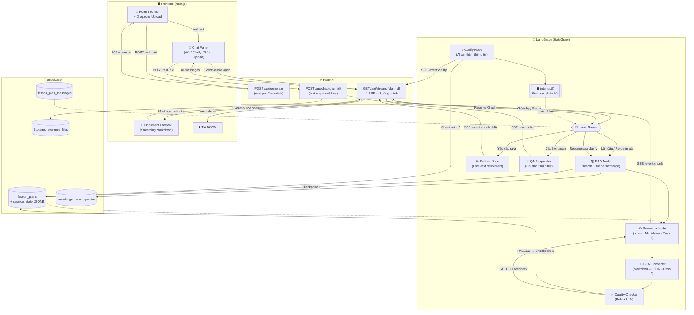
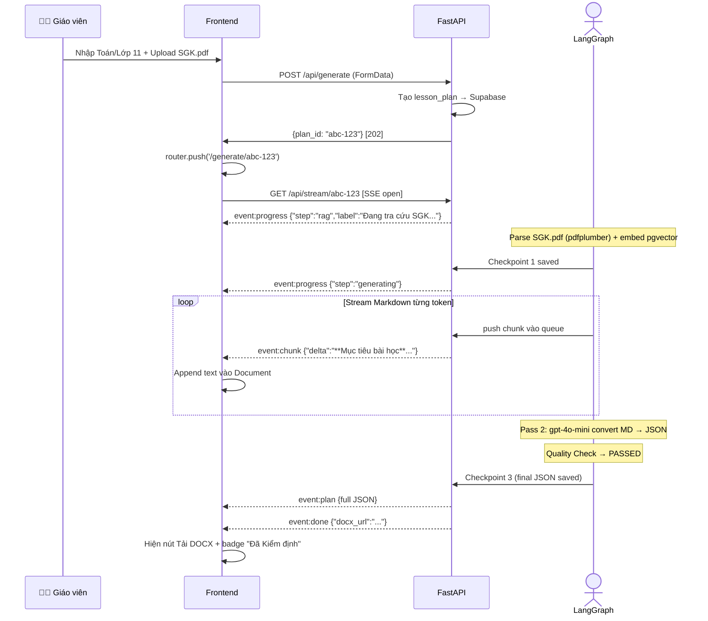
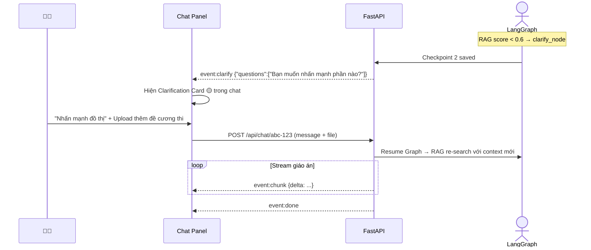
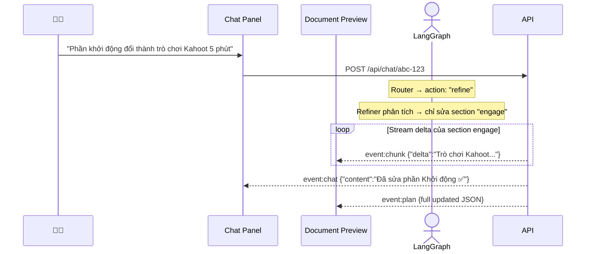

# 🏗️ Kế hoạch Nâng cấp Kiến trúc — Giáo Án Thông Minh


> **Codebase đã phân tích:** 7 Agents, 6 API routes, 9 Frontend components

---

## 📋 Mục lục

1. [Tóm tắt vấn đề hiện tại](#1-tóm-tắt-vấn-đề-hiện-tại)
2. [Yêu cầu nâng cấp](#2-yêu-cầu-nâng-cấp)
3. [Quyết định Kiến trúc (ADR)](#3-quyết-định-kiến-trúc-adr)
4. [Kiến trúc Tổng thể](#4-kiến-trúc-tổng-thể)
5. [SSE Protocol](#5-sse-protocol)
6. [Chi tiết thay đổi từng Layer](#6-chi-tiết-thay-đổi-từng-layer)
7. [Luồng User Journey](#7-luồng-user-journey)
8. [Kế hoạch Sprint](#8-kế-hoạch-sprint)
9. [Lộ trình cải tiến tương lai](#9-lộ-trình-cải-tiến-tương-lai)
10. [Bảng tổng hợp files cần thay đổi](#10-bảng-tổng-hợp-files-cần-thay-đổi)

---

## 1. Tóm tắt vấn đề hiện tại

| Điểm yếu | Hiện trạng | Mục tiêu nâng cấp |
|---|---|---|
| **Luồng tuyến tính** | `pipeline.py` dùng `for loop` + `dict` thủ công | StateGraph LangGraph có nhánh, vòng lặp |
| **Polling chậm** | Frontend poll `/api/status` mỗi 3 giây | SSE stream liên tục, không latency |
| **Giao diện gián đoạn** | Khi AI không tự tin → redirect sang `/clarify` riêng | Xuất hiện trong khung Chat, không redirect |
| **Không có Upload** | Form nhập thông tin chỉ nhận text | Hỗ trợ upload PDF/DOCX sách giáo khoa |
| **Edit thủ công theo Section** | `/api/edit` yêu cầu `section_id` cố định | AI tự hiểu yêu cầu bằng ngôn ngữ tự nhiên |

---

## 2. Yêu cầu nâng cấp

- ✅ **Chat hợp nhất**: Hỏi đáp, Clarification (AI hỏi ngược lại user), và Chỉnh sửa đều trong 1 khung chat
- ✅ **Streaming**: Response giáo án xuất hiện từng chữ (typewriter effect)
- ✅ **LangGraph**: Chuyển toàn bộ agent logic sang StateGraph
- ✅ **Upload tài liệu**: Hỗ trợ trong Form tạo mới và trong khung Chat
- ✅ **Bỏ trang Clarification riêng**: Xóa màn hình redirect "Cần bổ sung thông tin"

---

## 3. Quyết định Kiến trúc (ADR)

### ADR-01: Chiến lược xử lý File Upload

**Quyết định: Tiered Hybrid RAG** ✅

```
File size < 30KB  →  Đọc text trực tiếp, nhét vào prompt  [FAST PATH]
File size ≥ 30KB  →  Chunk → Embed → lưu pgvector        [RAG PATH]
```

**Lý do chọn:**

| Tiêu chí | Direct Injection | Full RAG | ✅ Tiered Hybrid |
|---|:---:|:---:|:---:|
| UX (tốc độ) | ✅ Nhanh | ❌ Chậm 5-15s | ✅ Tốt |
| Chi phí | ❌ ~$1/request | ✅ Rẻ | ✅ Hợp lý |
| File lớn (>150 trang) | ❌ Vượt context | ✅ OK | ✅ OK |
| Complexity | ✅ Đơn giản | 🟡 Trung bình | 🟡 Trung bình |
| Tương thích model | ❌ Cần model context lớn | ✅ Mọi model | ✅ Mọi model |

> **Lý do loại bỏ Direct Injection:** Primary model là `gpt-4o` (128K context). File PDF 50 trang ≈ 60K tokens. Cộng system prompt + lịch sử chat → dễ vượt ngưỡng và chi phí ~$1/request.

> **Lý do loại bỏ Full RAG:** Embedding 50 trang mất 5-15 giây, không chấp nhận được với file nhỏ (ví dụ: user upload 1 trang đề cương).

---

### ADR-02: Chiến lược Streaming JSON

**Quyết định: Two-Pass (Markdown Stream → JSON Convert)** ✅

```
Pass 1 (UX)  : Generator stream Markdown văn bản  →  FE hiển thị typewriter
Pass 2 (Data): gpt-4o-mini convert Markdown → JSON  →  Lưu DB, validate
```

**Lý do chọn:**

| Tiêu chí | Two-Pass ✅ | JSON Lines | Structured Streaming (Beta) |
|---|:---:|:---:|:---:|
| UX streaming | ✅ Tốt nhất | 🟡 Theo section | 🟡 Token-by-token JSON |
| Complexity implement | ✅ Thấp | 🔴 Cao | 🔴 Rất cao |
| Tương thích Gemini | ✅ | ❌ | ❌ |
| Ổn định production | ✅ | 🟡 | ❌ Beta |
| Chi phí thêm | ~$0.001 pass 2 | 0 | 0 |

---

### ADR-03: Persistence LangGraph Session State

**Quyết định: Checkpoint tại 3 điểm quan trọng vào Supabase** ✅

```
Checkpoint 1: Sau RAG Done        →  Lưu {rag_context, normalized_input}
Checkpoint 2: Sau Clarify Trigger →  Lưu {clarification_questions}
Checkpoint 3: Sau Generation Done →  Lưu {final_plan}  (đã làm sẵn)
```

**Lý do chọn:**

| Tiêu chí | In-Memory (cũ) | Redis | ✅ Checkpoint Supabase |
|---|:---:|:---:|:---:|
| Persist qua restart | ❌ | ✅ | ✅ |
| Infrastructure thêm | ✅ Không | ❌ Redis server | ✅ Không |
| Latency | ✅ ~0ms | 🟡 10-50ms/step | ✅ 3 writes/session |
| Scale nhiều instance | ❌ | ✅ | 🟡 Đủ dùng |
| Complexity | ✅ Thấp | 🔴 Cao | ✅ Thấp |

> **Trade-off chấp nhận được:** Nếu server crash giữa bước `generating`, user cần reload và gen lại. Xác suất rất thấp trong production có load balancer.

---

## 4. Kiến trúc Tổng thể



---

## 5. SSE Protocol

Thay thế hoàn toàn REST polling. Frontend dùng `EventSource` native (không cần thư viện).

```
event: progress  →  {"step": "rag"|"generating"|"quality_check", "label": "Đang tra cứu SGK..."}
event: chunk     →  {"type": "markdown", "delta": "**Mục tiêu bài học**\n- Học sinh..."}
event: chat      →  {"role": "assistant", "content": "Phần khởi động đã được sửa ✅"}
event: clarify   →  {"questions": ["Bạn muốn nhấn mạnh kiến thức nào?", "..."]}
event: plan      →  { full JSON lesson plan — gửi 1 lần sau khi generation xong }
event: done      →  {"plan_id": "...", "docx_url": "...", "status": "completed"}
event: error     →  {"message": "...", "recoverable": true|false}
```

---

## 6. Chi tiết thay đổi từng Layer

### 🗄️ Database (Supabase)

#### Schema mới cần tạo:

```sql
-- Bảng mới: lịch sử hội thoại
CREATE TABLE lesson_plan_messages (
    id UUID PRIMARY KEY DEFAULT uuid_generate_v4(),
    plan_id UUID REFERENCES lesson_plans(id) ON DELETE CASCADE,
    role TEXT CHECK (role IN ('user', 'assistant', 'system')),
    content TEXT NOT NULL,
    message_type TEXT DEFAULT 'chat', -- 'chat' | 'clarification' | 'refinement'
    attached_files JSONB DEFAULT '[]', -- [{name, url, parsed_text}]
    created_at TIMESTAMPTZ DEFAULT NOW()
);

-- Thêm cột vào lesson_plans (bảng đã có)
ALTER TABLE lesson_plans ADD COLUMN session_state JSONB DEFAULT '{}';
```

#### [MODIFY] `backend/app/database.py`
Thêm 4 hàm mới (không sửa hàm cũ):
- `save_message(plan_id, role, content, message_type, files)` → lưu tin nhắn
- `get_chat_history(plan_id, limit=20)` → lấy lịch sử
- `save_checkpoint(plan_id, state_key, state_value)` → lưu LangGraph checkpoint
- `get_checkpoint(plan_id, state_key)` → restore checkpoint

---

### 🧠 Agent / LangGraph

#### [MODIFY] `backend/app/agents/pipeline.py` 🔴 Thay đổi cốt lõi

Chuyển đổi từ `async def run_pipeline()` tuyến tính sang `StateGraph`:

```python
class GraphState(TypedDict):
    plan_id: str
    user_id: str
    messages: Annotated[list[BaseMessage], add_messages]  # LangGraph built-in
    normalized_input: Optional[dict]
    uploaded_docs: list[str]          # text parsed từ file user upload
    rag_context: list
    current_plan: Optional[dict]      # JSON giáo án hiện tại
    quality_result: Optional[dict]
    iteration: int
    action: str                       # "generate"|"refine"|"qa"|"clarify"
    stream_queue: Optional[asyncio.Queue]  # push chunks ra SSE
    checkpoint: str                   # "init"|"rag_done"|"clarifying"|"done"

# Graph
graph = StateGraph(GraphState)
graph.add_node("intent_router", ...)
graph.add_node("rag_retrieval", ...)
graph.add_node("generator", ...)         # stream=True
graph.add_node("json_converter", ...)    # Markdown → JSON (Pass 2)
graph.add_node("quality_check", ...)
graph.add_node("refiner", ...)
graph.add_node("qa_responder", ...)
graph.add_node("clarify", ...)

graph.set_entry_point("intent_router")
graph.add_conditional_edges("intent_router", route_by_action, {
    "generate": "rag_retrieval",
    "refine":   "refiner",
    "qa":       "qa_responder",
    "resume":   "generator",
})
graph.add_edge("rag_retrieval", "generator")
graph.add_edge("generator", "json_converter")
graph.add_edge("json_converter", "quality_check")
graph.add_conditional_edges("quality_check", check_quality, {
    "PASSED": END,
    "FAILED": "generator",  # loop với quality_feedback
})
graph.add_edge("clarify", END)  # interrupt() đợi user

app_graph = graph.compile(interrupt_before=["clarify"])
```

#### [NEW] `backend/app/agents/nodes/intent_router.py`
Dùng `CHEAP_MODEL (gpt-4o-mini)` để phân loại ý định:
- Không có `current_plan` hoặc gửi form data → `"generate"`
- User trả lời câu hỏi clarification → `"resume"`
- "Sửa...", "Thêm...", "Đổi...", "Làm lại phần..." → `"refine"`
- "Tại sao...", "Giải thích...", "Ý nghĩa là gì..." → `"qa"`

#### [NEW] `backend/app/agents/nodes/refiner.py`
Thay thế `/api/edit` cũ (chỉ sửa 1 section cố định):
```
Input:  current_plan JSON + user_message (ngôn ngữ tự nhiên)
Output: updated_plan JSON (chỉ thay đổi phần liên quan)
Model:  PRIMARY_MODEL (gpt-4o) — cần reasoning tốt
Stream: Có — push delta chunks ra SSE
```

#### [NEW] `backend/app/agents/nodes/qa_responder.py`
```
Input:  current_plan JSON + user_question
Output: text reply stream từng token
Model:  CHEAP_MODEL (gpt-4o-mini) — giảm cost
```

#### [NEW] `backend/app/agents/nodes/file_parser.py`
```
Input:  UploadFile (PDF / DOCX / TXT)
Output: text content (hoặc top-k RAG chunks nếu file lớn)

Logic Tiered:
  text_length < 2000 chars  →  return raw text (đưa thẳng vào prompt)
  text_length ≥ 2000 chars  →  chunk → embed → pgvector
                                → return top-k chunks liên quan
Libraries: pdfplumber (PDF), python-docx (DOCX) — đã có trong requirements.txt
```

#### [MODIFY] `backend/app/agents/generator.py`
- Bật `stream=True` trong `client.chat.completions.create()`
- Thêm tham số `stream_queue: asyncio.Queue` để push chunks ra SSE

#### [MODIFY] `backend/app/agents/rag.py`
- Thêm tham số `user_doc_chunks: list[str] = []`
- Merge user doc chunks vào rag_context (user docs ưu tiên cao hơn)

---

### ⚡ API Layer

#### [NEW] `backend/app/api/stream.py`
```python
@router.get("/api/stream/{plan_id}")
async def stream_lesson_plan(plan_id: str, request: Request):
    """
    SSE endpoint — Thay thế GET /api/status/{task_id}
    - Khởi chạy LangGraph trong background
    - Generator push chunks vào asyncio.Queue
    - Endpoint đọc Queue, gửi SSE events
    - Tự ngắt khi client disconnect
    """
```

#### [NEW] `backend/app/api/chat.py`
```python
@router.post("/api/chat/{plan_id}")
async def chat_with_plan(
    plan_id: str,
    message: str = Form(...),
    files: list[UploadFile] = File(default=[]),
    request: Request
):
    """
    Thay thế /api/clarification + /api/edit
    1. Lưu user message vào lesson_plan_messages
    2. Parse & embed files nếu có
    3. Resume LangGraph với message mới
    4. Kết quả stream qua SSE đang mở
    Returns: 202 Accepted
    """
```

#### [MODIFY] `backend/app/api/generate.py`
- Đổi từ `application/json` → `multipart/form-data`
- Nhận thêm `files[]` tùy chọn, xử lý async trong background
- Trả về `plan_id` ngay lập tức (không đợi pipeline)

#### [DELETE] `backend/app/api/clarification.py` → Gộp vào `chat.py`
#### [DELETE] `backend/app/api/edit.py` → Thay bằng Refiner Node

#### [MODIFY] `backend/app/main.py`
- Thêm import: `stream`, `chat`
- Xóa import: `clarification`, `edit`

---

### 🖥️ Frontend (Next.js)

#### Thay đổi luồng điều hướng:

```
❌ TRƯỚC:
/generate (form) → POST /api/generate → /generate/{task_id}
→ poll mỗi 3s → nếu clarifying → /generate/{task_id}/clarify (REDIRECT)

✅ SAU:
/generate (form + upload) → POST /api/generate → /generate/{plan_id}
→ Mở SSE → TẤT CẢ xử lý trong 1 màn hình (không redirect)
```

#### [MODIFY] `frontend/app/generate/page.tsx`
- Thêm Dropzone component (kéo thả PDF/DOCX/TXT)
- Danh sách file đã chọn với nút xóa
- Submit dùng `FormData` thay vì `JSON.stringify`
- Sau submit: `router.push('/generate/${plan_id}')` (dùng plan_id, không phải task_id)

#### [MODIFY] `frontend/app/generate/[task_id]/page.tsx`
```tsx
// XÓA toàn bộ:
// - useRef interval
// - pollStatus() function
// - logic kiểm tra status === 'clarifying' → router.push('/clarify')

// THÊM:
const sse = new EventSource(`${API_BASE}/api/stream/${planId}`)
sse.addEventListener('progress', e => setProgressStep(e.data))
sse.addEventListener('chunk',    e => appendMarkdown(e.data))
sse.addEventListener('chat',     e => appendChatMessage(e.data))
sse.addEventListener('clarify',  e => showClarifyCard(e.data))  // ← KHÔNG redirect
sse.addEventListener('plan',     e => setPlanJSON(e.data))
sse.addEventListener('done',     e => setIsComplete(true))
sse.addEventListener('error',    e => handleError(e.data))
```

#### [MODIFY] `frontend/components/RefinementChatUI.tsx` → nâng cấp thành `ChatPanel.tsx`
- Upload icon trong input bar (file picker + drag & drop)
- Message types:
  - User message: bubble phải, màu xanh
  - AI message: bubble trái, màu xám, streaming typewriter
  - **Clarification card**: nền vàng, icon ❓, hiện câu hỏi AI đặt ra
  - System message: centered, italic (VD: "Giáo án đã được cập nhật ✅")
- Gửi: `POST /api/chat/{planId}` với `FormData`

#### [DELETE] `frontend/app/generate/[task_id]/clarify/` — Toàn bộ thư mục
#### [DELETE] `frontend/components/ClarificationDialog.tsx`

#### [MODIFY] `frontend/lib/api.ts`
```typescript
// XÓA:
// getClarificationQuestions(), submitClarificationAnswers(), editSection()

// THÊM:
export function openSSEStream(planId: string): EventSource
export async function sendChatMessage(planId: string, message: string, files?: File[]): Promise<void>
export async function generateWithFiles(data: GeneratePayload, files?: File[]): Promise<{plan_id: string}>
```

---

## 7. Luồng User Journey

### Luồng 1: Tạo giáo án lần đầu (có upload SGK)



### Luồng 2: AI không tự tin → Hỏi qua Chat (không redirect)



### Luồng 3: Chỉnh sửa giáo án qua Chat



---

## 8. Kế hoạch Sprint

### Sprint 1 — Backend Core (Ngày 1-2)
- [ ] Tạo bảng `lesson_plan_messages` + alter `lesson_plans` thêm `session_state`
- [ ] Implement `database.py`: 4 hàm mới
- [ ] Refactor `pipeline.py` → LangGraph `StateGraph`
- [ ] Tạo `intent_router.py` node
- [ ] Implement SSE endpoint `stream.py`
- [ ] Test: curl SSE endpoint, verify event format

### Sprint 2 — Streaming + Nodes mới (Ngày 3-4)
- [ ] Bật `stream=True` trong `generator.py` + push chunks
- [ ] Implement `json_converter.py` (Markdown → JSON)
- [ ] Implement `refiner.py` (free-text refinement)
- [ ] Implement `qa_responder.py`
- [ ] Implement `file_parser.py` (Tiered strategy)
- [ ] Implement `POST /api/chat` endpoint
- [ ] Modify `POST /api/generate` → multipart

### Sprint 3 — Frontend (Ngày 5-6)
- [ ] Nâng cấp Form → dropzone upload
- [ ] Thay polling → SSE trong `generate/[plan_id]/page.tsx`
- [ ] Nâng cấp `RefinementChatUI` → `ChatPanel` đa năng
- [ ] Clarification Card trong chat (xóa màn hình redirect)
- [ ] Xóa `/clarify` page + `ClarificationDialog.tsx`
- [ ] Update `api.ts`

### Sprint 4 — Polish & Testing (Ngày 7)
- [ ] Test end-to-end 3 luồng chính
- [ ] Edge cases: SSE disconnect/reconnect, file quá lớn, timeout
- [ ] Loading states: skeleton, typing indicator
- [ ] Verify DOCX export vẫn hoạt động sau refiner

---

## 9. Lộ trình cải tiến tương lai

### Q1 — Nâng cấp File Upload

| Phiên bản | Khi nào | Tính năng | Effort |
|---|---|---|---|
| **MVP** (hiện tại) | Ngay | Tiered Hybrid (< 30KB → prompt, ≥ 30KB → RAG) | ✅ Đang làm |
| **V2** | 50-200 users | Async Queue processing + Shared KB per school | 🟡 1-2 ngày |
| **V3** | 500+ users | Multimodal RAG (hình ảnh, bảng biểu, công thức) | 🟠 1 tuần |
| **V4** | Platform scale | Teacher Library + Index toàn bộ SGK quốc gia | 🔴 1+ tháng |

**Chi tiết V2:**
- File upload → asyncio Queue → worker embed song song khi user đang điền form
- Nếu nhiều giáo viên cùng trường upload SGK Toán Lớp 11 → embed 1 lần, chia sẻ cho tất cả (tiết kiệm 95% embedding cost)

**Chi tiết V3:**
- Dùng `GPT-4o Vision` hoặc `Gemini 1.5 Flash` để đọc hình ảnh, bảng biểu, công thức toán học
- `pdfplumber` hiện tại chỉ đọc được text thuần
- Hierarchical chunking (theo cấu trúc Chương → Bài → Mục) thay vì chunking theo ký tự cố định

**Chi tiết V4:**
- Mỗi giáo viên có thư viện tài liệu riêng (đã index sẵn), không cần upload lại
- Index toàn bộ SGK Việt Nam vào VectorDB — giải quyết triệt để bài toán RAG confidence thấp

---

### Q3 — Nâng cấp Session State Persistence

| Phiên bản | Khi nào | Giải pháp | Effort |
|---|---|---|---|
| **MVP** (hiện tại) | Ngay | Checkpoint 3 điểm vào Supabase JSONB | ✅ Đang làm |
| **V2** | Khi cần reliability / nhiều instance | LangGraph `PostgresSaver` built-in | 🟡 1 ngày |
| **V3** | 500+ concurrent users | Redis + `AsyncRedisSaver` + sync PostgreSQL | 🟠 1 tuần |
| **V4** | Platform / Debug / Audit | Time-travel + Long-running Multi-session | 🔴 1+ tháng |

**Chi tiết V2 — LangGraph PostgresSaver:**
```python
# Chỉ cần thêm 3 dòng, LangGraph tự xử lý toàn bộ
from langgraph.checkpoint.postgres import PostgresSaver
checkpointer = PostgresSaver(conn_string=SUPABASE_POSTGRES_URL)
app_graph = graph.compile(checkpointer=checkpointer)
# → LangGraph tự save/restore state sau mỗi node, zero code tùy chỉnh
```
> Supabase dùng PostgreSQL → tương thích 100% không cần migration.

**Chi tiết V3 — Redis:**
- State persist trong Redis (sub-millisecond read/write)
- Sync định kỳ sang PostgreSQL để long-term storage
- Cho phép horizontal scaling nhiều FastAPI instance

**Chi tiết V4 — Time-travel:**
- LangGraph hỗ trợ xem lại lịch sử quyết định tại mỗi bước
- User có thể "undo" về phiên bản giáo án trước đó
- Giáo viên bắt đầu soạn hôm nay, tiếp tục hôm sau — graph resume chính xác

---

## 10. Bảng tổng hợp Files cần thay đổi

| File | Hành động | Mức độ | Ghi chú |
|---|---|:---:|---|
| `backend/app/agents/pipeline.py` | MODIFY | 🔴 Lớn | Refactor sang StateGraph |
| `backend/app/agents/generator.py` | MODIFY | 🟡 Trung bình | Thêm streaming |
| `backend/app/agents/rag.py` | MODIFY | 🟢 Nhỏ | Thêm user_docs param |
| `backend/app/database.py` | MODIFY | 🟡 Trung bình | Thêm 4 hàm mới |
| `backend/app/api/stream.py` | **NEW** | 🆕 | SSE endpoint |
| `backend/app/api/chat.py` | **NEW** | 🆕 | Chat endpoint |
| `backend/app/api/generate.py` | MODIFY | 🟡 Trung bình | Multipart + file |
| `backend/app/api/clarification.py` | **DELETE** | ❌ | Gộp vào chat.py |
| `backend/app/api/edit.py` | **DELETE** | ❌ | Thay bằng Refiner Node |
| `backend/app/agents/nodes/intent_router.py` | **NEW** | 🆕 | |
| `backend/app/agents/nodes/refiner.py` | **NEW** | 🆕 | |
| `backend/app/agents/nodes/qa_responder.py` | **NEW** | 🆕 | |
| `backend/app/agents/nodes/file_parser.py` | **NEW** | 🆕 | |
| `backend/app/main.py` | MODIFY | 🟢 Nhỏ | Import routes |
| `frontend/app/generate/page.tsx` | MODIFY | 🟡 Trung bình | Thêm Upload |
| `frontend/app/generate/[task_id]/page.tsx` | MODIFY | 🔴 Lớn | Polling → SSE |
| `frontend/app/generate/[task_id]/clarify/` | **DELETE** | ❌ | Toàn bộ thư mục |
| `frontend/components/RefinementChatUI.tsx` | MODIFY | 🔴 Lớn | → ChatPanel đa năng |
| `frontend/components/ClarificationDialog.tsx` | **DELETE** | ❌ | |
| `frontend/lib/api.ts` | MODIFY | 🟡 Trung bình | New functions |

**Tổng:** 14 files modify, 5 files new, 4 files delete

---

*File này được tạo tự động bởi AI System Architect. Mọi thay đổi thiết kế cần cập nhật vào file này.*
