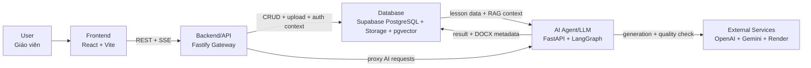

# A20 App 003 - Soạn giáo án thông minh

Cập nhật lần cuối: 2026-05-16

## Liên kết quan trọng

| Tài liệu | Nội dung |
|---|---|
| [Sơ đồ kiến trúc](ARCHITECTURE_DIAGRAM.md) | Bối cảnh hệ thống, container, sequence, data model và triển khai |
| [Nhật ký tuần](JOURNAL.md) | Mục tiêu, kết quả, khó khăn và cách xử lý theo từng tuần |
| [Nhật ký công việc](WORKLOG.md) | Phân công, thời gian, trạng thái, ghi chú và quyết định kỹ thuật |
| [Minh chứng đánh giá](EVALUATION_EVIDENCE.md) | Kết quả kiểm thử, chỉ số, phản hồi và checklist ảnh chụp màn hình |
| [Hướng dẫn vận hành](GUIDE.md) | Setup, chạy local, kiểm tra chất lượng và xử lý lỗi thường gặp |
| [Kịch bản demo](DEMO_SCRIPT.md) | Luồng demo sản phẩm và checklist trước khi trình bày |
| [PRD](PRD%20So%E1%BA%A1n%20gi%C3%A1o%20%C3%A1n%20th%C3%B4ng%20minh.md) | Bài toán sản phẩm, phạm vi MVP và yêu cầu người dùng |

## Đối chiếu yêu cầu tài liệu

| Yêu cầu trong ảnh | Vị trí trong repo |
|---|---|
| README có tên dự án, mô tả, mục tiêu, tính năng, công nghệ, cài đặt, chạy và sử dụng | Các mục chính trong README này |
| Link quan trọng đặt ngay phần đầu README | Mục [Liên kết quan trọng](#liên-kết-quan-trọng) |
| Sơ đồ kiến trúc và luồng dữ liệu | Mục [Kiến trúc tổng quan](#kiến-trúc-tổng-quan) và `ARCHITECTURE_DIAGRAM.md` |
| Weekly journal | `JOURNAL.md` |
| Worklog | `WORKLOG.md` |
| Evaluation evidence, test, metrics, feedback và ảnh chụp | `EVALUATION_EVIDENCE.md` |

## Tên dự án

**A20 App 003 - Soạn giáo án thông minh**

Ứng dụng hỗ trợ giáo viên Việt Nam tạo giáo án theo định hướng GDPT 2018. Giáo viên nhập thông tin bài dạy, chọn mô hình dạy học, bổ sung tài liệu tham khảo, theo dõi tiến trình sinh nội dung, chỉnh sửa bằng chat và xuất giáo án thành file DOCX.

## Mô tả ngắn gọn

Dự án xây dựng một web app gồm frontend React/Vite, API Gateway Node.js/Fastify và AI Service Python/FastAPI. Hệ thống dùng Supabase cho xác thực, cơ sở dữ liệu, lưu trữ file và pgvector; AI Service dùng LangGraph để điều phối RAG, sinh giáo án, kiểm tra chất lượng, chuyển đổi JSON và định dạng DOCX.

## Mục tiêu và vấn đề giải quyết

Giáo viên thường mất nhiều thời gian để soạn giáo án đúng cấu trúc, có hoạt động học rõ ràng, có tiêu chí đánh giá và có thể chỉnh sửa để phù hợp lớp học thực tế. Dự án giải quyết ba nhu cầu chính:

- Rút ngắn thời gian tạo bản nháp giáo án theo môn, lớp, chủ đề và mô hình dạy học.
- Giữ giáo viên ở vai trò kiểm duyệt cuối cùng thông qua preview, chỉnh sửa inline và chat tinh chỉnh.
- Lưu lại tài nguyên, giáo án và bản DOCX để tái sử dụng trong các buổi dạy sau.

## Tính năng chính

- Đăng nhập và bảo vệ route bằng Supabase Auth.
- Tạo giáo án từ form thông minh tại `/generate`.
- Upload tài liệu tham khảo của giáo viên.
- Dùng RAG từ kho `data/raw/` và tài nguyên đã ingest.
- Theo dõi tiến trình sinh giáo án bằng Server-Sent Events.
- Preview, chỉnh sửa inline và lưu nội dung giáo án.
- Chat để hỏi đáp hoặc yêu cầu tinh chỉnh giáo án đã tạo.
- Kiểm tra chất lượng giáo án tại `/check`.
- Xuất giáo án thành file DOCX có thể chỉnh sửa.
- Quản lý thư viện giáo án và tài nguyên dạy học.

## Công nghệ sử dụng

| Thành phần | Công nghệ | Vai trò |
|---|---|---|
| `frontend/` | React 18, Vite, Tailwind CSS, React Router, Zustand, Supabase JS | Giao diện giáo viên, form tạo giáo án, preview, thư viện, tài nguyên và SSE client |
| `api-gateway/` | Node.js, Fastify, TypeScript, Drizzle ORM, Zod | Xác thực JWT, CRUD API, upload, proxy SSE, proxy export DOCX |
| `ai-service/` | Python, FastAPI, LangGraph, OpenAI/Gemini, python-docx | RAG, sinh giáo án, kiểm tra chất lượng, chuyển JSON, định dạng DOCX |
| `data/raw/` | Markdown | Kho dữ liệu chương trình học để ingest vào RAG |
| Supabase | Auth, PostgreSQL, Storage, pgvector | Người dùng, giáo án, tài nguyên, file và embeddings |
| Render | `render.yaml` | Blueprint triển khai ba service |

## Kiến trúc tổng quan



Luồng dữ liệu chính:

```text
User -> Frontend -> Backend/API -> Database -> AI Agent/LLM -> External Services
```

Trong triển khai thực tế, API Gateway proxy yêu cầu sang AI Service, AI Service đọc/ghi Supabase và gọi OpenAI/Gemini khi cần sinh nội dung.

Tài liệu chi tiết hơn nằm trong [ARCHITECTURE_DIAGRAM.md](ARCHITECTURE_DIAGRAM.md).

## Hướng dẫn cài đặt

Cài hook ghi log prompt một lần trước khi tạo pull request:

```bash
bash scripts/setup_hooks.sh
```

Cài dependency cho từng service:

```bash
cd ai-service
python -m venv venv
venv/Scripts/activate
pip install -r requirements.txt

cd ../api-gateway
npm install

cd ../frontend
npm install
```

Tạo file môi trường:

```bash
cp frontend/.env.example frontend/.env
cp api-gateway/.env.example api-gateway/.env
```

Tạo `ai-service/.env` theo các biến mà `ai-service/app/config.py` sử dụng:

```env
OPENAI_API_KEY=sk-...
GOOGLE_API_KEY=...
LANGSMITH_API_KEY=...
DATABASE_URL=postgresql://...
SUPABASE_URL=https://your-project.supabase.co
SUPABASE_SERVICE_KEY=...
AI_SERVICE_SECRET=
RAW_RAG_AUTO_INDEX=false
```

Các biến frontend quan trọng:

```env
VITE_SUPABASE_URL=https://your-project.supabase.co
VITE_SUPABASE_ANON_KEY=your-anon-key
VITE_API_BASE_URL=http://localhost:3001
VITE_USE_MOCK=false
```

## Chuẩn bị cơ sở dữ liệu

Đẩy schema Drizzle:

```bash
cd api-gateway
npm run db:push
```

Seed tài nguyên hệ thống mẫu nếu cần:

```bash
cd api-gateway
npm run db:seed
```

Ingest dữ liệu RAG từ `data/raw/` nếu cần dùng corpus thật:

```bash
cd ai-service
venv/Scripts/activate
python -m app.scripts.ingest_raw_data
```

## Hướng dẫn chạy dự án

Chạy ba service trong ba terminal riêng.

AI Service:

```bash
cd ai-service
venv/Scripts/activate
uvicorn app.main:app --reload --host 0.0.0.0 --port 8000
```

API Gateway:

```bash
cd api-gateway
npm run dev
```

Frontend:

```bash
cd frontend
npm run dev
```

URL mặc định:

```text
Frontend:    http://localhost:5173
API Gateway: http://localhost:3001
AI Service:  http://localhost:8000
```

Kiểm tra health:

```bash
curl http://localhost:8000/ai/health
curl http://localhost:3001/health
```

## Hướng dẫn sử dụng sản phẩm

1. Mở `http://localhost:5173`.
2. Đăng nhập hoặc tạo tài khoản ở `/login`.
3. Vào `/generate`, nhập môn học, lớp, chủ đề, mô hình dạy học và yêu cầu bổ sung.
4. Upload tài liệu tham khảo nếu có.
5. Gửi yêu cầu tạo giáo án và theo dõi tiến trình ở `/generate/:planId`.
6. Xem bản preview, chỉnh sửa inline hoặc dùng chat để yêu cầu AI tinh chỉnh.
7. Lưu giáo án vào thư viện.
8. Kiểm tra chất lượng tại `/check` nếu cần.
9. Xuất DOCX để tiếp tục chỉnh sửa hoặc nộp bản cuối.

## Route chính

| Route frontend | Chức năng |
|---|---|
| `/` | Trang tổng quan |
| `/login` | Đăng nhập và đăng ký bằng Supabase |
| `/generate` | Form tạo giáo án mới |
| `/generate/:planId` | Theo dõi streaming, chat, preview và xuất DOCX |
| `/plans/:id` | Chi tiết giáo án đã lưu |
| `/library` | Thư viện giáo án |
| `/resources` | Tài nguyên hệ thống và tài nguyên người dùng |
| `/check` | Kiểm tra chất lượng giáo án |

## Lệnh kiểm tra

```bash
cd frontend
npm run build

cd ../api-gateway
npm run build

cd ../ai-service
pytest
```

Kết quả kiểm tra gần nhất được ghi trong [EVALUATION_EVIDENCE.md](EVALUATION_EVIDENCE.md).

## Quy định pull request

Không tạo PR trước khi chạy:

```bash
bash scripts/setup_hooks.sh
```

Mô tả PR cần dùng định dạng:

```markdown
## Summary
<mô tả thay đổi>

## Changes
- <danh sách file thay đổi>
```

Không commit `.ai-log/*.jsonl`; các file này đã được gitignore và sẽ được submit tự động khi `git push`.
