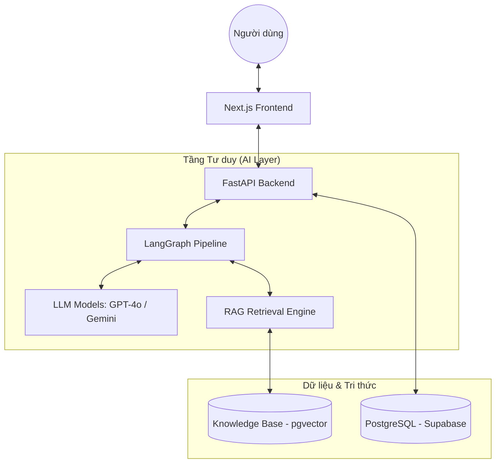
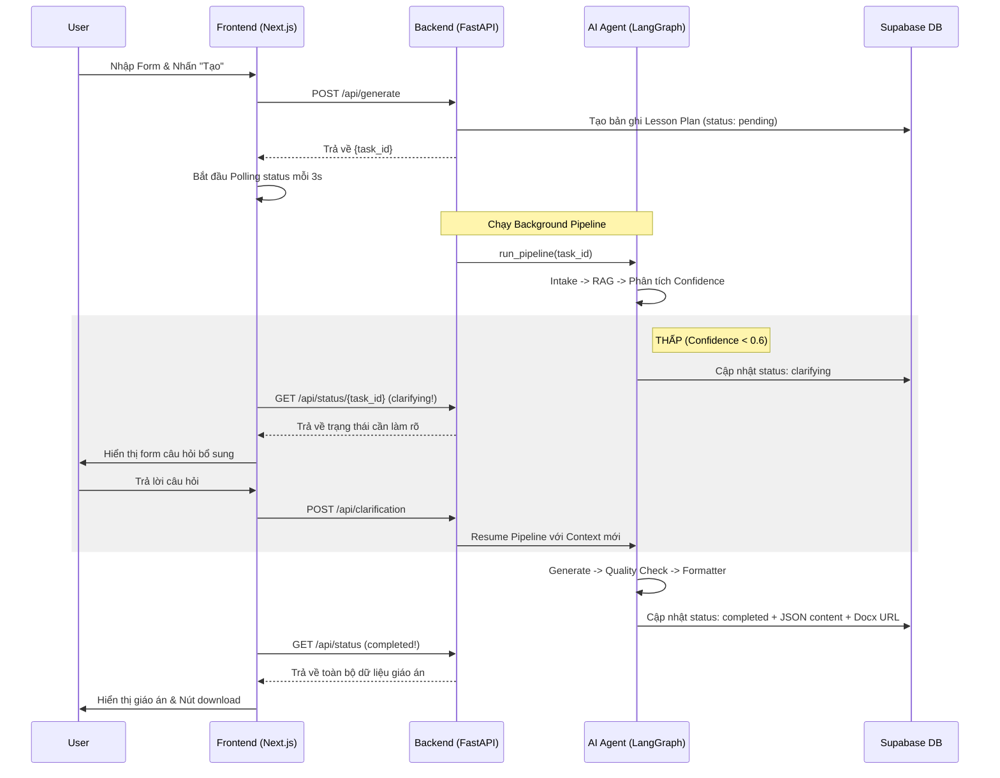

# Tài liệu Kiến trúc Hệ thống & Luồng Nghiệp vụ (Chi tiết)

Tài liệu này cung cấp cái nhìn sâu sắc về mặt kỹ thuật cho dự án **Smart Lesson Plan Generator** (Công cụ Soạn giáo án Thông minh). Nội dung bao gồm kiến trúc giải pháp, thiết kế hạ tầng, logic nội bộ của AI Agent Pipeline và hành trình người dùng chi tiết.

---

## 1. Tổng quan Kiến trúc Hệ thống

Hệ thống được thiết kế theo mô hình **Modern Web Architecture** kết hợp với **Multi-Agent RAG Pipeline**.

### 1.1. Các lớp thành phần (Architecture Layers)

| Lớp (Layer) | Công nghệ | Vai trò & Trách nhiệm |
|---|---|---|
| **Frontend** | **Next.js (App Router)** | Xử lý UI/UX, quản lý trạng thái client, điều hướng luồng người dùng (Form input, Polling, Clarification form, Dashboard). |
| **Backend** | **FastAPI (Python)** | Xương sống xử lý logíc: Quản lý API RESTful, quản lý tác vụ ngầm (Background Tasks), điều phối (Orchestration) AI Agents. |
| **AI Layer** | **LangGraph / LLMs** | Bộ não hệ thống: Sử dụng LangGraph để thiết kế State Machine cho các Agents (GPT-4o, Gemini 1.5 Pro). |
| **Database** | **Supabase (PostgreSQL)** | Lưu trữ dữ liệu chuẩn: Thông tin giáo án, kết quả đánh giá, phiên hỏi đáp, thông tin User. |
| **Vector Store** | **Supabase (pgvector)** | Lưu trữ tri thức (Knowledge Base) dưới dạng Vector Embeddings hỗ trợ tìm kiếm ngữ nghĩa (Semantic Search). |

### 1.2. Sơ đồ Kiến trúc Macro

---

## 2. Chi tiết AI Agent Pipeline (The "Brain")

Logic quan trọng nhất nằm ở `backend/app/agents/pipeline.py`. Quy trình bao gồm 6 giai đoạn chính được quản lý theo dạng **State Machine**.

### Giai đoạn 1: Intake & Normalization (Tiếp nhận & Chuẩn hóa)
- **Agent**: `intake.py`
- **Logic**: 
    - Kiểm tra xem prompt của giáo viên có nằm trong phạm vi giáo dục không (Scope Guard).
    - Nếu nội dung rác (spam, chat phiếm), hệ thống sẽ từ chối ngay.
    - Chuẩn hóa các trường đầu vào (Môn học, Khối lớp, Chủ đề) về định dạng chuẩn để RAG hoạt động tốt hơn.

### Giai đoạn 2: RAG Retrieval (Truy xuất Tri thức)
- **Agent**: `rag.py`
- **Logic**: 
    - Chuyển đổi yêu cầu thành Vector Embedding.
    - Tìm kiếm trong `rag_knowledge_base` các nội dung liên quan (Phương pháp giảng dạy 5E, kiến thức chuẩn GDPT 2018).
    - **Cơ chế Confidence Score**: Tính toán độ tin cậy của kết quả tìm kiếm.

### Giai đoạn 3: Clarification Logic (Cơ chế Hỏi đáp bổ sung)
- **Trạng thái**: Đây là một nút rẽ nhánh (Decision node). 
- **Điều kiện**: Nếu Confidence Score < 0.6 hoặc input của người dùng quá mập mờ.
- **Xử lý**: 
    - Pipeline tạm dừng (**PAUSE**). 
    - Trạng thái task chuyển thành `clarifying`.
    - Gửi yêu cầu về Frontend để hiện Form đặt câu hỏi cho giáo viên (ví dụ: "Bạn muốn tập trung vào kỹ năng nào trong bài này?").
    - Pipeline chỉ tiếp tục (**RESUME**) khi giáo viên gửi câu trả lời qua API `/api/clarification`.

### Giai đoạn 4: Multi-Iteration Generation (Tạo nội dung đa lớp)
- **Agent**: `generator.py`
- **Logic**: 
    - LLM nhận Context từ RAG + Câu trả lời từ Clarification + Input ban đầu.
    - Sinh ra cấu trúc JSON chi tiết (Metadata, Mục tiêu, Thiết bị, Tiến trình 5E hoặc 3-Phase).
    - Nếu phát hiện lỗi format hoặc thiếu field, hệ thống tự động chạy lại (tối đa 3 lần).

### Giai đoạn 5: Quality Check & Validation (Kiểm định Chất lượng)
- **Agent**: `quality_checker.py`
- **Logic**: 
    - Đối chiếu giáo án với bộ tiêu chí (GDPT 2018, số bước 5E, ngôn ngữ Tiếng Việt).
    - Nếu "Failed", lỗi sẽ được gửi ngược lại cho Generator Agent kèm theo feedback để sửa đổi (Self-Correction loop).

### Giai đoạn 6: Formatter & Export (Định dạng & Xuất file)
- **Agent**: `formatter.py`
- **Logic**: 
    - Chuyển đổi JSON cuối cùng thành file Microsoft Word (.docx).
    - Upload file vào Supabase Storage và trả về URL tải xuống.

---

## 3. Luồng Người dùng Chi tiết (End-to-End User Flow)

### 3.1. Giai đoạn Khởi tạo (Initiation)
1. **Truy cập**: Người dùng vào Dashboard, nhấn "Soạn giáo án mới".
2. **Nhập liệu**: Điền Form (Môn, Lớp, Chủ đề, Mô hình giảng dạy).
3. **Gửi yêu cầu**: Frontend gọi `POST /api/generate`. Backend lưu bản ghi vào DB với trạng thái `pending` và trả về `task_id` ngay lập tức.
4. **Điều hướng**: Frontend điều hướng người dùng sang trang `app/plans/[task_id]` (Trang đang xử lý).

### 3.2. Giai đoạn Theo dõi (Polling & Monitoring)
1. **Polling**: Frontend gọi `GET /api/status/{task_id}` mỗi 3 giây.
2. **Hiển thị Progress**: UI hiển thị các bước thời gian thực (ví dụ: "Đang phân tích yêu cầu", "Đang truy xuất kho tri thức...").
3. **Trường hợp Clarification**: 
    - Nếu status chuyển thành `clarifying`.
    - UI sẽ hiển thị một Modal hoặc Form đặc biệt chứa các câu hỏi từ AI.
    - Người dùng trả lời -> Frontend gọi `POST /api/clarification` -> Pipeline tiếp tục chạy.

### 3.3. Giai đoạn Xem kết quả & Tải về (Review)
1. **Hoàn tất**: Khi polling trả về status `completed`.
2. **Hiển thị**: UI load nội dung JSON của giáo án, hiển thị dưới dạng các thẻ đẹp mắt (Engage, Explore, Explain, v.v.).
3. **Chỉnh sửa (Optional)**: Người dùng có thể nhấn vào từng mục để dùng AI chỉnh sửa nhanh qua API `/api/edit`.
4. **Tải về**: Người dùng nhấn "Tải file Word" để nhận file `.docx` chuyên nghiệp.

---

## 4. Sơ đồ Luồng Dữ liệu (Sequence Diagram)

---

## 5. Xử lý Lỗi & Fallback (Safety Nets)

Để đảm bảo hệ thống không "chết" hoàn toàn khi AI gặp lỗi, chúng tôi áp dụng 3 lớp bảo vệ:

1. **Self-Correction Loop**: Nếu Generator sinh ra JSON sai cấu trúc, Quality Checker sẽ yêu cầu sinh lại tối đa 3 lần.
2. **Model Fallback**:
    - Ưu tiên: **GPT-4o** (Thông minh nhất).
    - Dự phòng 1: **Gemini 1.5 Pro** (Nếu OpenAI lỗi hoặc hết hạn mức).
    - Dự phòng 2: **GPT-4o-mini** (Tiết kiệm Token nhưng vẫn đảm bảo cấu trúc).
3. **Blank Template Fallback**: Nếu cả 3 model đều thất bại hoặc không ra kết quả sau nhiều lần thử, hệ thống sẽ trả về một **"Giáo án khung trắng"** (Blank Template DOCX) dựa trên topic người dùng nhập để giáo viên tự điền, tránh việc trả về màn hình lỗi trắng.

---

> [!IMPORTANT]
> **Lưu ý cho Lập trình viên**: Trạng thái của pipeline được đồng bộ giữa **In-memory Task Store** (để phản hồi nhanh cho Polling) và **Supabase DB** (để lưu trữ bền vững). Luôn kiểm tra `task_id` trước khi truy vấn trạng thái.
