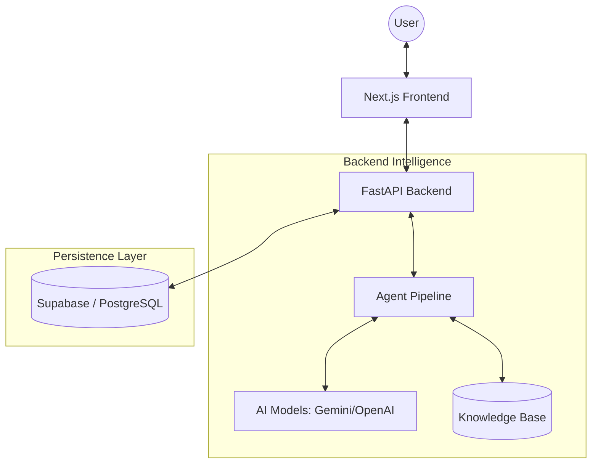
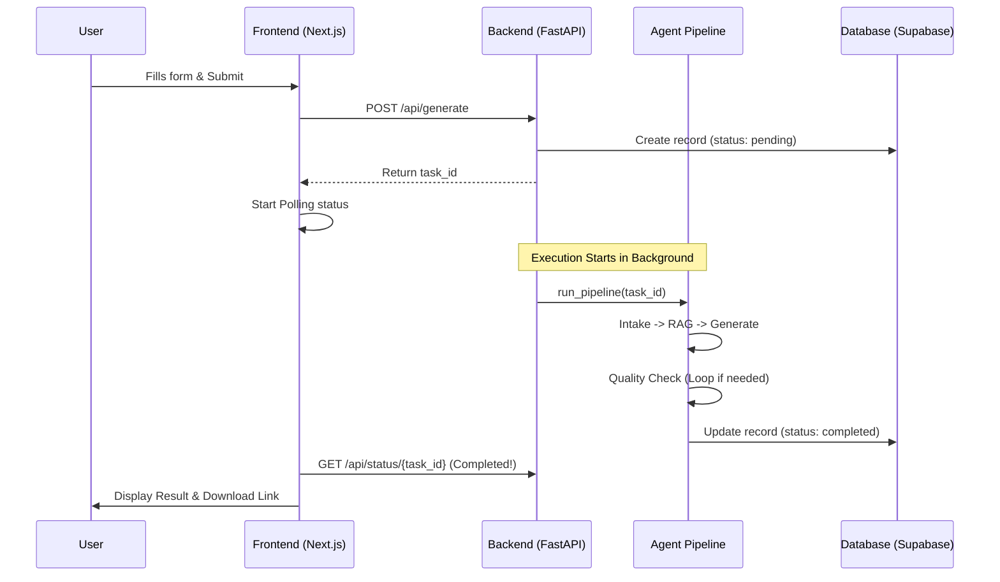

# System Architecture & User Flow

This document provides a detailed technical overview of the Smart Lesson Plan Generator (Vibe Coding project). It covers the system design, the internal AI agent pipeline, and the step-by-step user journey.

---

## 1. System Overview

The application is a full-stack platform designed to help teachers generate high-quality, compliant lesson plans (e.g., following the 5E model) using advanced AI agents. It leverages a Retrieval-Augmented Generation (RAG) approach to ensure all content is grounded in the project's knowledge base.

---

## 2. Technology Stack

| Layer | Technology | Key Responsibility |
|---|---|---|
| **Frontend** | Next.js 14+ (App Router) | UI/UX, Client-side state, API orchestration. |
| **Styling** | Tailwind CSS / Lucide React | Responsive design and iconography. |
| **Backend** | FastAPI (Python) | RESTful API, Background task management, AI Orchestration. |
| **AI Layer** | LangGraph / LLMs (Gemini, OpenAI) | Multi-agent reasoning, RAG, and content generation. |
| **Persistence** | Supabase (PostgreSQL) | User data, Lesson plan storage, Quality evaluations. |
| **Cache/State** | In-memory Task Store | Tracking real-time progress steps of the AI pipeline. |

---

## 3. High-Level Architecture Diagram

---

## 4. The AI Agent Pipeline (The "Brain")

The core logic resides in a multi-stage pipeline (`backend/app/agents/pipeline.py`) that ensures every lesson plan is accurate and validated.

### Stage 1: Intake & Normalization
- **Purpose**: Parse user input and verify scope.
- **Process**: The AI checks if the request is related to education and lesson planning. It normalizes fields like "Subject", "Grade", and "Topic" into a standard format.

### Stage 2: RAG (Retrieval-Augmented Generation)
- **Purpose**: Ground the AI in specific knowledge.
- **Process**: The system retrieves relevant teaching models (e.g., 5E, Bloom's Taxonomy) and content standards from the local Knowledge Base (`backend/kb/`).

### Stage 3: Clarification (Optional Pause)
- **Purpose**: Resolve ambiguity.
- **Process**: If the user's input is too vague (low confidence), the pipeline pauses and asks the teacher clarifying questions via the UI.

### Stage 4: Generation (Multi-Iteration)
- **Purpose**: Create the content.
- **Process**: The LLM generates a draft based on the intake data and RAG context. If the first draft fails quality checks, it enters a retry loop (up to `MAX_ITERATIONS`).

### Stage 5: Quality Check & Verification
- **Purpose**: Ensure compliance.
- **Process**: A dedicated agent (`quality_checker.py`) verifies the plan against specific rules (e.g., must have 5 stages, must be in Vietnamese, must have objectives).

### Stage 6: Formatting & Export
- **Purpose**: Prepare for human use.
- **Process**: The final JSON structure is converted into a professional DOCX file for download.

---

## 5. Detailed User Flow

### Phase A: Input & Initiation
1.  **Dashboard**: User enters the dashboard and clicks "Generate New Plan".
2.  **Form Input**: User provides Topic, Grade, Subject, and optionally specific Objectives.
3.  **API POST**: The frontend sends a `POST /api/generate` request.
4.  **Instant Feedback**: The backend returns a `task_id` immediately, and the UI redirects to a loading/status page.

### Phase B: Monitored Generation
1.  **Polling**: The frontend calls `GET /api/status/{task_id}` every 3 seconds.
2.  **Progress Updates**: The UI shows real-time steps: *"Analyzing input..."* -> *"Searching Knowledge Base..."* -> *"Generating draft..."*.
3.  **Interaction (if needed)**: If the pipeline requests clarification, the polling status changes to `clarifying`, and a form appears for the teacher to provide more details.

### Phase C: Review & Finalization
1.  **Completion**: Once the status hits `completed`, the UI fetches the final plan metadata.
2.  **Plan Details**: User views the generated plan on the `app/plans/[task_id]` page.
3.  **DOCX Download**: User clicks the "Download" button to get the pre-generated Word document.

---

## 6. Data Flow Sequence

---

> [!TIP]
> **Pro-tip**: The system uses an in-memory `task_store` for lightning-fast status updates during the generation process, but persists all final results to Supabase for long-term storage.
