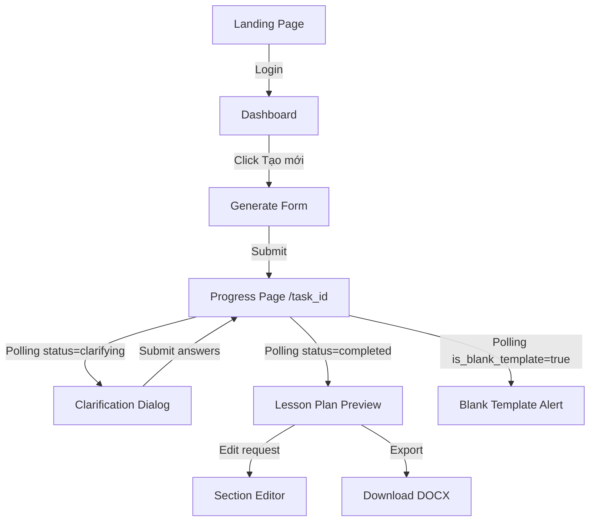

# 🎨 Frontend Architecture & Implementation Plan: Soạn Giáo Án Thông Minh

Chào bạn! Với tư cách là **Senior Frontend Engineer**, tôi đã nghiên cứu kỹ PRD và kiến trúc Multi-Agent của hệ thống. Đây không chỉ là một ứng dụng Web thông thường; đây là một **AI-Native Interface** cần sự mượt mà, minh bạch về tiến độ (Progressive Disclosure) và trải nghiệm cao cấp (Premium UX).

Dưới đây là bản thiết kế chi tiết cho "bệ phóng" Frontend của chúng ta.

---

## 🏗️ 1. Kiến trúc tổng thể (Architecture)

### Tech Stack
- **Framework**: Next.js 14.2+ (App Router). *Tại sao?* Vì SEO tốt cho Landing Page, Server Components giúp fetch dữ liệu nhanh, và cơ chế Routing mới cực kỳ mạnh mẽ.
- **Styling**: Vanilla CSS + Tailwind CSS (Hybrid).
    - *Senior Tip*: Chúng ta dùng Tailwind cho **Layout** (flex, grid, spacing) để làm cực nhanh, nhưng dùng Vanilla CSS cho **Premium Design** (glassmorphism, gradient phức tạp, keyframe animations) để có bản sắc riêng.
- **State Management**: React Context (cho Auth & Global UI) + URL State (cho Task ID).
- **Auth**: Supabase Auth (Auth Helpers).
- **Realtime**: Polling (3s interval) cho MVP.

### Sơ đồ luồng Frontend

---

## 💎 2. Design System & Aesthetics
Để đạt chuẩn **Premium**, chúng ta sẽ không dùng các màu cơ bản.
- **Primary**: `Deep Ocean Blue` (#0F172A) phối hợp với `Vibrant Teal` (#2DD4BF).
- **Background**: `Soft Slate` (#F8FAFC) với các lớp `Glassmorphism` (backdrop-filter: blur).
- **Typography**: `Inter` hoặc `Plus Jakarta Sans` cho cảm giác hiện đại, chuyên nghiệp.
- **Animations**: Sử dụng `Framer Motion` cho các hiệu ứng slide-up của form và "pulsing" của progress tracker.

---

## 📋 3. Danh sách Nhiệm vụ (Implementation Tasks)

### Phase 1: Foundation & Auth (Nền móng)
- [ ] **Task 1.1: Setup Project & Design Tokens**: Cấu hình `tailwind.config.ts` với bảng màu và font chữ đã chọn. Setup `globals.css`.
- [ ] **Task 1.2: Supabase Client & Auth Middleware**: Thiết lập kết nối Auth, bảo vệ các route `/dashboard`, `/generate`.
- [ ] **Task 1.3: Layout & Navigation**: Xây dựng Header (User Profile) và Sidebar điều hướng.

### Phase 2: Core User Flow (Luồng chính)
- [ ] **Task 2.1: DASHBOARD - Quản lý giáo án**: Hiển thị danh sách các bản ghi từ Supabase. Trạng thái Badge (Đã xong, Đang tạo, Lỗi).
- [ ] **Task 2.2: GENERATE FORM - "Trái tim" ứng dụng**: Xây dựng form nhập liệu đa bước. Validate kỹ dữ liệu đầu vào.
- [ ] **Task 2.3: PROGRESS TRACKER - Trải nghiệm AI**: Xây dựng UI Stepper hiển thị quy trình của Agent (Intake -> RAG -> Generating -> Quality Check).
    - *Senior Tip*: Tuyệt đối không để màn hình đứng yên. Phải có hiệu ứng loading/progress mượt mà.

### Phase 3: AI Interaction & Results (Tương tác AI)
- [ ] **Task 3.1: CLARIFICATION INTERFACE**: Xây dựng màn hình hỏi-đáp khi AI cần thêm thông tin. Đây là điểm chạm quan trọng để xây dựng niềm tin (Trust).
- [ ] **Task 3.2: LESSON PLAN RENDERER**: Render JSON trả về thành một bản giáo án HTML đẹp, chuẩn format.
- [ ] **Task 3.3: COMPLIANCE REPORT**: Hiển thị danh sách các mục đã đạt (✅) và chưa đạt (❌) kèm gợi ý của AI.

---

## 🎓 4. Góc học tập (Senior FE Teaching)

### Bài học 1: Tại sao dùng Polling cho dự án 2 ngày?
Trong production lớn, chúng ta dùng **WebSockets**. Nhưng trong Sprint 2 ngày, WebSockets đòi hỏi xử lý "Connection Life Cycle" rất phức tạp (reconnect, heartbeat). 
**Polling (HTTP GET mỗi 3s)** cực kỳ bền bỉ (robust), dễ debug và đủ tốt cho người dùng cá nhân. Chúng ta sẽ dùng `swr` hoặc `useEffect` để quản lý việc này.

### Bài học 2: Kỹ thuật Lock & Sync
Khi AI đang soạn (Generating), chúng ta phải **Lock** các nút bấm để người dùng không gửi yêu cầu trùng lặp. 
Trạng thái của UI phải luôn phản ánh đúng trạng thái của Database (`status` trong bảng `lesson_plans`).

### Bài học 3: Progressive Disclosure (Tiết lộ dần dần)
Đừng bắt user nhìn thấy toàn bộ 100 dòng JSON. Hãy chia giáo án thành các **Accordions** hoặc **Tabs**. Điều này làm giảm gánh nặng nhận thức (Cognitive Load).

---

## 🚀 5. Bước tiếp theo?
Bạn hãy xem qua bản kế hoạch này. Nếu "Vibe" đã ổn, tôi sẽ gửi cho bạn **Task 1: Setup Foundation & Design System** để chúng ta bắt đầu thực hiện ngay lập tức!

**Bạn thấy Plan này thế nào? Có phần nào bạn muốn tôi giải thích kỹ hơn không?**
