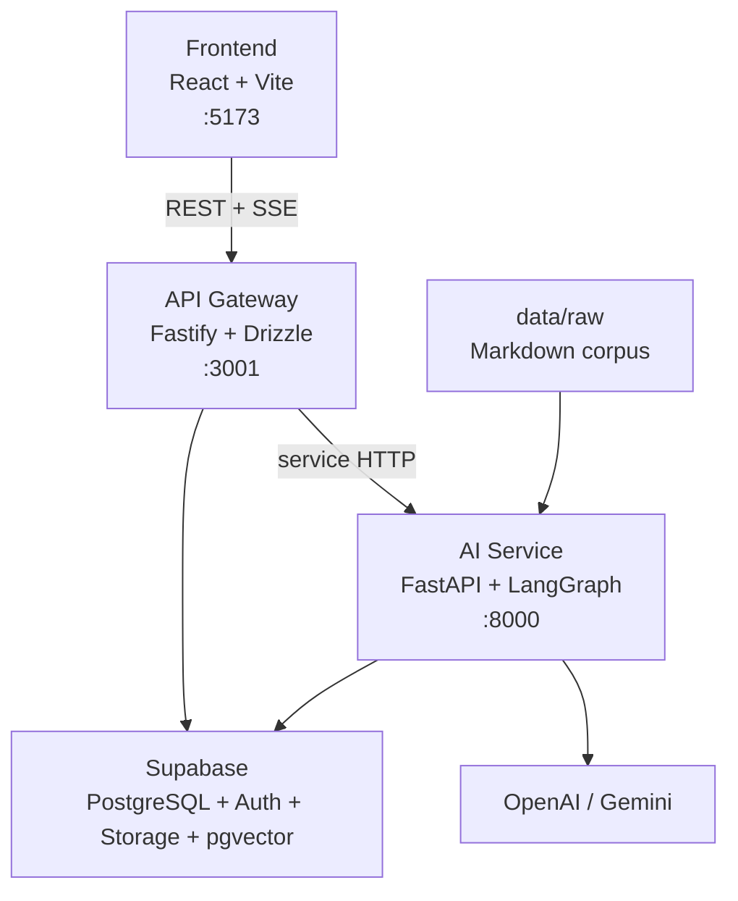

# Maintenance Guide

Operational notes for maintaining A20 App 003.

Last updated: 2026-05-15

## Current Architecture



## Service Responsibilities

| Service | Owns | Does not own |
|---|---|---|
| Frontend | UI state, Supabase session, form flow, SSE consumption, inline editing UI | Database writes outside API Gateway |
| API Gateway | Auth enforcement, plan/resource CRUD, uploads, SSE proxy, DOCX proxy, rate limits | LLM prompts or document formatting |
| AI Service | RAG, generation, quality check, JSON conversion, DOCX formatting | Browser auth or Supabase user session handling |
| Supabase | Auth, PostgreSQL, storage, pgvector data | Application business logic |

## Important Files

| File | Purpose |
|---|---|
| `frontend/src/App.tsx` | Route definitions |
| `frontend/src/lib/api.ts` | Frontend API client |
| `frontend/src/lib/env.ts` | Vite env and legacy key fallback |
| `api-gateway/src/app.ts` | Fastify app setup and route registration |
| `api-gateway/src/config.ts` | Gateway env parsing |
| `api-gateway/src/db/schema.ts` | Drizzle database schema |
| `api-gateway/src/services/ai-client.ts` | Gateway client for AI Service |
| `ai-service/app/main.py` | FastAPI app setup |
| `ai-service/app/config.py` | AI Service env parsing |
| `ai-service/app/graph/pipeline.py` | LangGraph pipeline |
| `ai-service/app/services/raw_data_ingestor.py` | Markdown corpus ingestion |
| `render.yaml` | Render deployment blueprint |

## Data Model

Main tables:

- `lesson_plans`: plan metadata, markdown, structured JSON, compliance status, DOCX URL.
- `lesson_plan_messages`: chat and refinement history for a plan.
- `resources`: user and system teaching resources.
- `resource_embeddings`: pgvector chunks for retrieval.

The API Gateway schema is the source of truth for migrations.

## Generation Flow

1. Frontend submits `POST /api/plans`.
2. API Gateway creates a `lesson_plans` row with status `pending`.
3. API Gateway uploads any user files and forwards the generation request to AI Service.
4. AI Service stores transient generation state and starts the LangGraph pipeline.
5. Frontend opens `GET /api/plans/:id/stream`.
6. API Gateway proxies `GET /ai/stream/:plan_id`.
7. AI Service emits progress, plan, done, or error events.
8. API Gateway persists generated markdown/JSON/status/DOCX URL.
9. Frontend polls status while export is being prepared.

## Chat and Refinement Flow

1. Frontend sends `POST /api/plans/:id/chat`.
2. API Gateway stores the user message.
3. API Gateway forwards the message and plan context to AI Service.
4. AI Service classifies the intent as QA or refinement.
5. API Gateway streams the assistant response and persists changes when plan content is updated.

## RAG Resource Flow

System resources can come from two paths:

- `npm run db:seed` creates placeholder resource rows.
- `python -m app.scripts.ingest_raw_data` indexes real Markdown files from `data/raw/` and writes embeddings.

Use ingestion when testing grounded generation. Placeholder rows are useful for UI testing only because they do not contain embedded text.

## Common Maintenance Tasks

### Update database schema

```bash
cd api-gateway
npm run db:generate
npm run db:push
```

### Re-index raw RAG data

```bash
cd ai-service
venv/Scripts/activate
python -m app.scripts.ingest_raw_data
```

### Run service checks

```bash
cd frontend
npm run build

cd ../api-gateway
npm run build

cd ../ai-service
pytest
```

### Check service health

```bash
curl http://localhost:3001/health
curl http://localhost:8000/ai/health
```

## Deployment Notes

`render.yaml` defines three Render services:

- `a20-ai-service`
- `a20-api-gateway`
- `a20-frontend-ui`

Production env must include:

- Supabase URL and keys for all relevant services.
- `DATABASE_URL` for API Gateway and AI Service.
- `OPENAI_API_KEY` for AI Service.
- `AI_SERVICE_URL` for API Gateway.
- `VITE_API_BASE_URL` for Frontend.
- Matching `AI_SERVICE_SECRET` values if internal auth is enabled.

## Known Risks

- Several older source comments and UI labels contain mojibake text. Avoid copying those strings into new docs; fix source encoding separately if UI text quality is in scope.
- Raw Markdown corpus currently focuses on Grade 8 Math and Natural Science. Demo topics should match available data unless more corpus files are added.
- DOCX export is async; after inline edits, the frontend may mark the existing export stale.
- AI Service in-memory generation state is not durable across service restarts.

## PR Checklist

- Run relevant build/tests for touched services.
- Confirm docs mention Vite port `5173`, not old Next.js port `3000`.
- Run `bash scripts/setup_hooks.sh` before creating a PR.
- Do not commit `.ai-log/*.jsonl`.
- PR description includes `## Summary` and `## Changes`.
